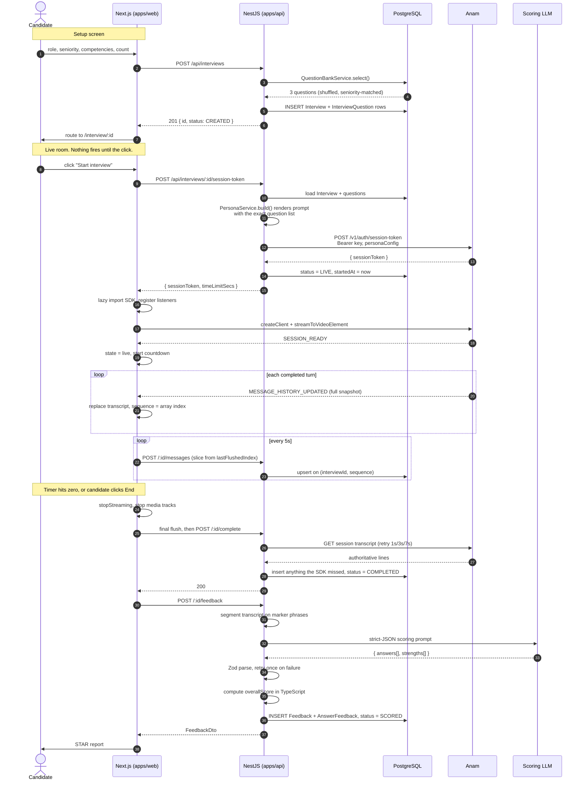
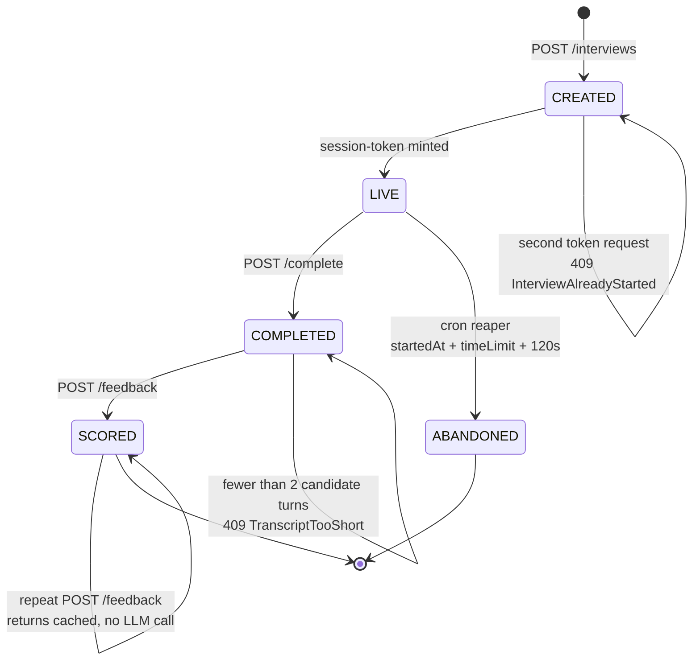
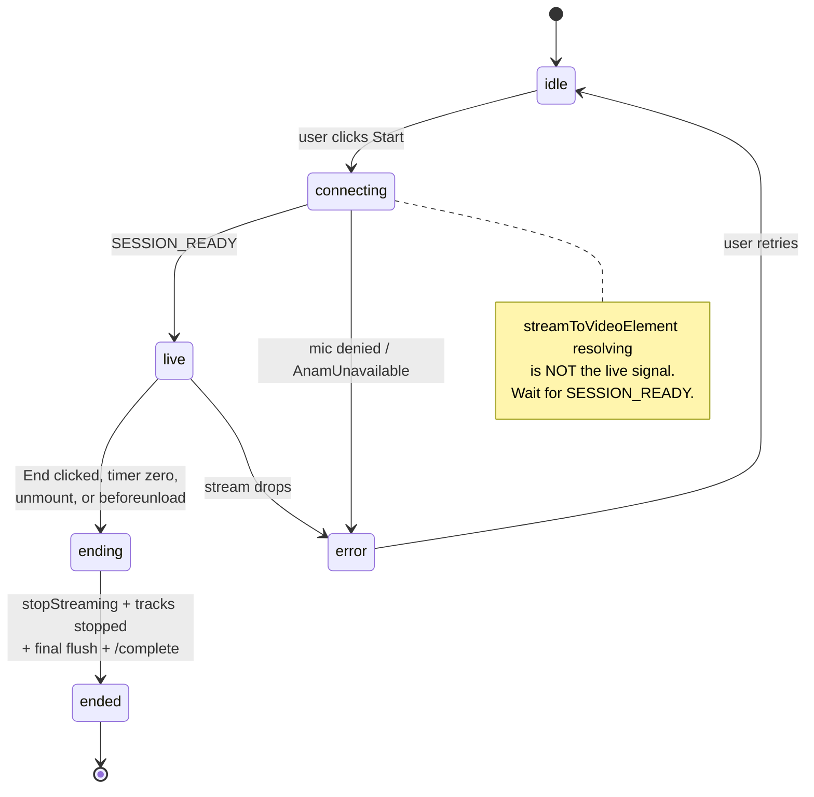
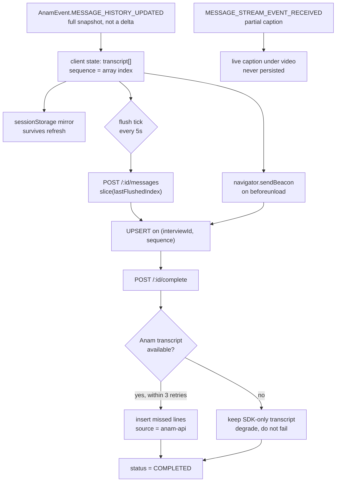
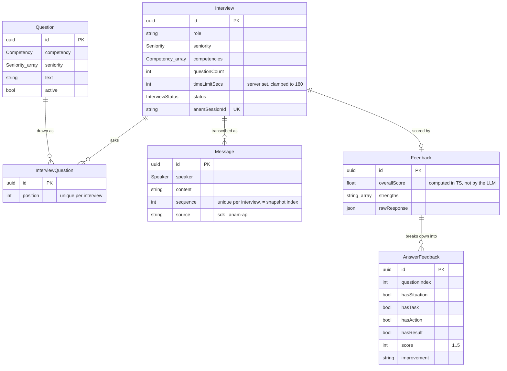
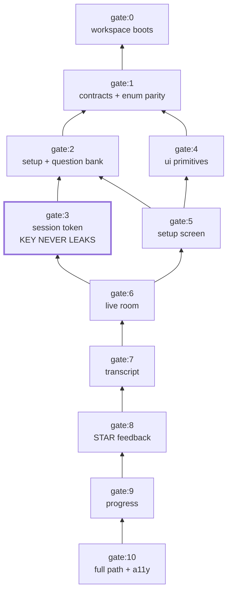

# Architecture and Flow

Visual companion to the spec pack. Every diagram here is normative: if an implementation
disagrees with a diagram, the implementation is wrong.

Mermaid renders on GitHub, in VS Code with the Markdown Preview Mermaid extension, and in
most md viewers.

---

## 1. System topology

The single most important line in this diagram is the trust boundary. `ANAM_API_KEY` and
`ANTHROPIC_API_KEY` exist only inside the trusted box. The browser receives a short-lived
session token and nothing else.

```mermaid
flowchart LR
  subgraph browser["Browser (untrusted)"]
    UI["Next.js app<br/>apps/web"]
    SDK["@anam-ai/js-sdk"]
    VID["video element"]
    MIC["microphone"]
  end

  subgraph server["Your server (trusted)"]
    API["NestJS API<br/>apps/api"]
    DB[("PostgreSQL<br/>via Prisma")]
  end

  subgraph third["Third party"]
    ANAM["Anam<br/>api.anam.ai"]
    LLM["Scoring LLM<br/>Anthropic Messages API"]
  end

  UI -->|"1. POST /interviews"| API
  API -->|"2. select questions"| DB
  UI -->|"3. POST /:id/session-token"| API
  API -->|"4. Bearer ANAM_API_KEY<br/>+ personaConfig"| ANAM
  ANAM -->|"5. sessionToken"| API
  API -->|"6. sessionToken only"| UI
  UI --> SDK
  MIC --> SDK
  SDK <-->|"7. WebRTC media"| ANAM
  SDK --> VID
  SDK -->|"8. MESSAGE_HISTORY_UPDATED"| UI
  UI -->|"9. POST /:id/messages"| API
  API --> DB
  API -->|"10. GET session transcript<br/>(unverified, see README)"| ANAM
  API -->|"11. transcript + scoring prompt"| LLM
  LLM -->|"12. STAR JSON"| API
```

**The key never crosses arrow 6.** Gate 3 asserts this against the raw serialised response
body, not the parsed object.

---

## 2. Interview lifecycle, end to end

---

## 3. Interview status (server side)

Persisted on the `Interview` row. Owned by the API, never set by the client.

`ABANDONED` exists because a closed tab otherwise leaves rows stuck `LIVE` forever and the
history screen fills with ghosts.

---

## 4. Session state (client side)

Owned by `useAnamSession`. Drives every control in the live room.

Control availability by state:

| State | Start | Skip | End |
|---|---|---|---|
| idle | enabled | disabled | disabled |
| connecting | disabled, "Connecting..." | disabled | enabled |
| live | disabled | enabled | enabled |
| ending / ended / error | disabled | disabled | disabled |

---

## 5. Transcript flow

The subtlest part of the system, and the one most likely to be implemented wrong.

Two rules the diagram encodes:

1. **Upsert, not insert-skip-duplicates.** Anam rewrites history when a turn is interrupted,
   so the content at a given sequence can change after you first stored it. A
   `skipDuplicates` insert silently keeps the stale text.
2. **Partials are never persisted.** They are superseded by the next snapshot.

---

## 6. Data model

`InterviewQuestion` is what lets the feedback step know the exact question text without
parsing it back out of the transcript.

---

## 7. Build order and gate dependencies

Each gate re-runs every gate below it, so an arrow means "cannot be green unless this is
green".

Gate 4 branches off gate 1 rather than gate 3, so UI primitive work can proceed in parallel
with the token service if two agents are running.

---

## 8. Which document governs which arrow

| Diagram element | Spec |
|---|---|
| Trust boundary, env vars, phase order | `README.md` |
| Arrows 1 to 5, 9 to 12 in the topology | `backend.md` |
| Arrows 6 to 9, both client state machines | `frontend.md` |
| Enum casing, wire shapes, UI primitives | `shared.md` |
| Every gate node in diagram 7 | `testing.md` |

---

## 9. What can go wrong, by location

| Failure | Where it surfaces | Designed response |
|---|---|---|
| Anam 5xx at token time | topology arrow 4 | 502 `AnamUnavailable`, upstream body never forwarded |
| Double click on Start | client `connecting` state | Start disabled, and 409 server side as backstop |
| Mic permission denied | client `connecting` to `error` | permission message with the fix, not an apology |
| Stream drops mid-session | client `live` to `error` | answers so far are saved, End still available |
| Tab closed mid-session | no `/complete` call | `sendBeacon` final flush, then cron reaper marks `ABANDONED` |
| Anam transcript API missing | diagram 5, `REC` node | degrade to SDK-only transcript, still return 200 |
| LLM returns malformed JSON | scoring step | one retry with the parse error, then 502 and persist nothing |
| Interrupted turn rewrites history | diagram 5, `UPS` node | upsert on `(interviewId, sequence)` |
